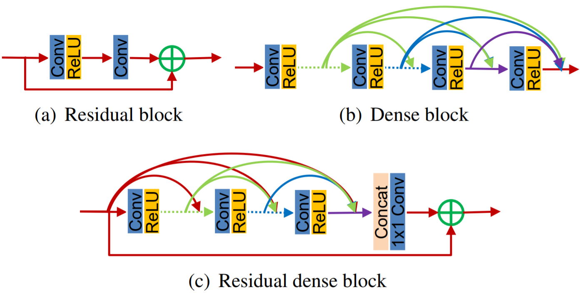
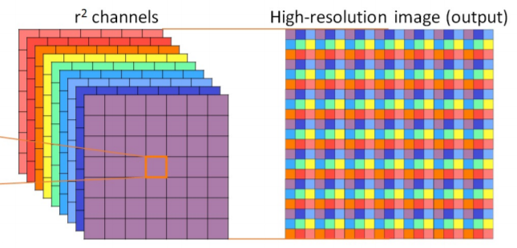
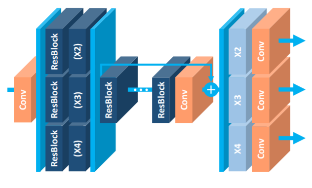
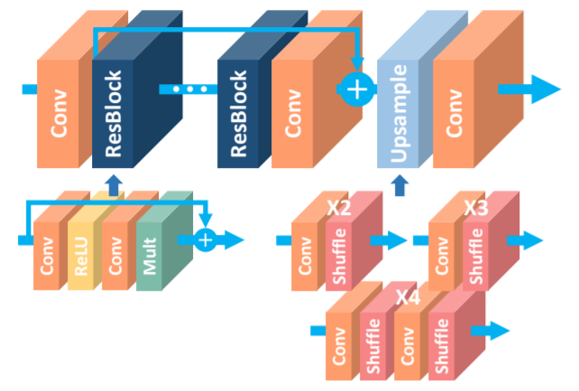

*딥러닝 실험 노트*
=============
- - -
###2019년 10월 16일

- - -
> 1. pytorch
>   * 각각의 배치마다 gpu에 네트워크를 gpu에 올린다. 즉 batchsize*netparameters가 gpu 위에 올라가는 듯 하다. (아래 예제 참조)
>   * 실험 초기에 네트워크가 학습을 포기한다면 네트워크의 깊이나 넓이를 넓혀 보라.
>

```
# 배치사이즈가 100이여도 전체 메모리의 20% 밖에 차지 하지 않음.
Total params: 57,186
Trainable params: 57,186
Non-trainable params: 0
----------------------------------------------------------------
Input size (MB): 0.27
Forward/backward pass size (MB): 84.75
Params size (MB): 0.22
Estimated Total Size (MB): 85.24
----------------------------------------------------------------

================================================================
# 배치사이즈가 49이여도 전체 메모리의 80% 차지.
Total params: 64,872
Trainable params: 64,872
Non-trainable params: 0
----------------------------------------------------------------
Input size (MB): 0.27
Forward/backward pass size (MB): 747.50
Params size (MB): 0.25
Estimated Total Size (MB): 748.02
----------------------------------------------------------------
```
> 2. Video Codec
> * Prediction 관련...
>   * Prediction에서 만큼은 Pixel의 L1, L2 loss를 사용하면 안 될 것 같다.
>   * Inter는 잘 모르겠지만 Intra에서 Prediction과 Original의 SATD를 계산한다.
>   * 그 이유는 Residual의 Transform Domain에서의 신호 몰림을 최대화 하기위해서로 추정된다. (아래 예제)
```----------------------------------------------------------------
예를들어 Original 신호가 500 500 500 이라면 
Prediction을 100 100 100으로 하든 450 450 450 으로 하든 
Residual의 Transform 신호는 DC에 몰리게 되고, 
이를 Quantization을 실행하면 에러는 확률적으로 비슷하다.
하지만 Pixel Domain에서의 MSE는 매우 차이가 크다.
----------------------------------------------------------------
```
- - -
###2019년 10월 17일

- - -
> 1. Video Codec
>   * Prediction 관련...
>       * 다시 생각해봐도 Prediction Block이 아닌 Prediction Mode를 예측하려는 
>일종의 fast Algorithm을 CNN등의 알고리즘으로 개발할려고 한다면, 
>학습 데이터 셋을 만들때 SATD를 Hadamard Transform 등의 Fast한 방법이 아닌 DCT등의
>좀 더 정확한 방법으로 만들어야 할 것 같다. 
>       * 이러한 생각을 하게 된 계기는, Deep Learning은 원래 GT의 성능을 넘을 수 는 없다.
> 따라서 GT의 성능을 높여서 학습을하면 높은 성능의 GT를 학습할 수 있을 것이다.
>
>2. Pytorch
>   * FC에 새로운 정보를 Concat할려고 할때 Best한 방법은 Network의 Input으로 정보 값을 
>주고, forward에서 concat하는 것 같다. 아래 예제를 첨부한다. 이러한 경우 Sequential class를 효율적으로 사용할 수 없는데,
>이를 해결할 방법을 지금 당장은 떠오르지 않는다. 성능에는 차이가 없지만, forward를 좀 더 깔끔하게 구현하면 좋을텐데..
```angular2
class MyModel(nn.Module):
    def __init__(self):
        super(MyModel, self).__init__()
        self.cnn = models.inception_v3(pretrained=False, aux_logits=False)
        self.cnn.fc = nn.Linear(
            self.cnn.fc.in_features, 20)
        self.fc1 = nn.Linear(20 + 10, 60)
        self.fc2 = nn.Linear(60, 5)
        
    def forward(self, image, data):
        x1 = self.cnn(image)
        x = torch.cat((x1, data), dim=1)
        x = F.relu(self.fc1(x))
        x = self.fc2(x)
        return x
```
>3. 논문
>   * **Do Better ImageNet Models Transfer Better?**
>       * CVPR 2019에서 Google이 발표한 논문 중 하나이다.
>       * 결론을 정리하면 transfer Coding에서 일부 네트워크 가중치를 그대로 쓰는 것은 별로다.
>       * **가장 좋은 방법은 Fine Tuning**인데, 사실 지금까지 내가 Transfer Learning을 사용하지 않은 이유는 Video Codec이 기본적으로 YUV도메인이기 때문이였는데, 
>생각해보니 약간 멍청했었던게, 내가 한 네트워크를 제대로 학습해두고 그것을 Transfer 해서 사용하면 되었다.
>       * 그런데 내 실험은 Input을 바꾸는 경우가 많은데 이 경우에도 Transfer Learning이 유효한지는 논문에 나와있지 않다.
>       * ETRI는 Transfer Learning에 대해 어떻게 생각하는지 궁금하다.
>
>
>
- - -
###2019년 10월 25일

- - -

> 1. Channel 개수 C, layer 개수 D와 CNN 네트워크 복잡성에 관하여.
>       * 이미지의 width와 height는 고정이라고 볼 수 있다.
>       * layer당 Input Feature Map이 동일한 Network라고 가정하면 (Output Channel도 당연히 같다.) Channel 개수 C는 전체 연산량에 정비례한다.
>       * layer 개수는 어떨까. 처음과 마지막 layer를 제외하면 layer 개수가 늘어나면 전체 연산량이 정비례 할 것이다.
>       * RDB 등의 Channel Concat layer에서는 어떨까. RDB 내부 layer의 개수를 n, growth_rate = g, input layer의 개수를 il, output layer를 ol이라 하면,
>         il*g + (il+g)*g + (il+2g)*g +  . . . + (il + (n-2)g)*g + (il+(n-1)*g)*ol = ((n-1)*il + (g*(n-1)*n)/2)*g + (il + (n-1)*g)*ol 이므로
>         RDN 내부 growth_rate에 O(n^2), layer 개수 n에 O(n^2)을 가짐.
>
>2. layer 수에 따른 성능 변화 및 Global Residual Connection에 대하여...
>
>       * 현재 실험하는 RDN 구조는 다음과 같다.
>


- - -
###2019년 10월 27일

- - -

> 1. RDB 실험결과
>   * Input

>       
>       * Input 은 동일하게 132x132 크기의 CTU를 네트워크 초기에 Padding 없는
>Convolution을 통해 128x128 Luma로 회귀하는 네트워크 이다.
>
>   * Network

>       
>
>       
>       * Network의 구조는 다음과 같다. 가장 유의깊게 봐야 하는 부분은, Network Output이 Residual임에도 불구하고, Network Output을 생성하는 Convolution 이전에 Globally한 Residual connection이 필요하였다.
>       * Globally한  Residual connection이 없으면 성능개선이 전혀 없었다.
>       * Output이 Residual이 아닌 경우에도 성능 개선이 없었다.       
>       * 심지어 RDB는 내부에도 Residual connection이 필요하다.
>       * Padding을 날리기 위한 3x3 Conv layer 2개를 1개의 5x5 Conv를 Padding 없이 사용하여 보았을때도 성능저하가 극심하였다.
>   * 처음에는 비교적 깊은 네트워크를 차용하였다.
>   1. 일반 Convolution featuermap : 32, RDN 갯수 : 3, RDN 내부 layer 개수 : 6, growth rate : 16
>       * 평균 0.15dB PSNR gain
>   2. 일반 Convolution featuermap : 32, RDN 갯수 : 4, RDN 내부 layer 개수 : 6, growth rate : 24
>       * 평균 0.20dB PSNR gain
>
>
>
>  2. UpSampling method

>       
>       * "Real-Time Single Image and Video Super-Resolution Using an Efficient
Sub-Pixel Convolutional Neural Network" 해당 논문을 참고.
>       * Pytorch의 경우 nn.PixelShuffle(scale)을 사용하면 된다.
>       * Upsampling method에 대해서는 딱히 비교한 논문을 찾아보지 못했지만, transpose(deconvolution) 방법이 한때 각광 받았으나, 계단 현상이 생긴다는 말이 있다.
>       * ~~반대되는 연산을 아직 찾지 못했다.~~ (help_torch.py에 직접구현 - UnPixelShuffle())
>   
>  3. 새로운 RDB 실험 시작
>       * TrainingSet을 DIV-2K와 MPEG Dataset을 섞어서 다시 진행
>       * RDB에 DownSampling과 Upsampling을 적용하여 다시 (일반 Convolution featuremap : 64, RDN 갯수 : 4, 내부 layer 갯수 : 6, growth rate: 24)
>           * 실험결과 : 0.08 PSNR Gain
>       * 왜 잘 안됫을까... 다른 논문이나 Ntire 2019 에서는 Width, Height를 줄인다음에 다시 늘리는 것이 성능이 좋은 것 으로 보이는데.. Net이 좀 더 깊어야 되거나 학습을 좀 더 안정적으로 할 수 있는 기믹이 필요해 보이기도 한다.
>   4. 직관성 있는 그림 메모
>
>       
>
>       
>       출처 : http://openaccess.thecvf.com/content_cvpr_2017_workshops/w12/papers/Lim_Enhanced_Deep_Residual_CVPR_2017_paper.pdf
>
>
>
- - -
###2019년 11월 2일

- - -

>1. 피어슨 상관 계수.
>   - QP 값과 VVC Error Residual MSE 사이의 상관계수 : 0.5476
>   - 전체 QP에서 CTU 내부 Depth의 평균과 VVC Error Resiudal MSE : 0.1886 
>       - QP : 22 : 0.5369
>       - QP : 27 : 0.4024
>       - QP : 32 : 0.5617
>       - QP : 37 : 0.6722
>   - BayesianOptimization를 통해 a*QP + b*depth_mean = w라 할때, w와 VVC Error Residual MSE 의 Correlation이 최대가 되는 a, b를 찾음
>       - a = 0.2817, b = 0.8561, correlation = 0.6748
>       - b를 1로 고정할때 : a = 0.3290, correlation = 0.6748
>

- - -
###2019년 11월 5일

- - -

>1. Pytorch Memory 관련..
>   - 지금까지 잘 못 생각 하고 있었던 것이 pytorch나 tensorflow에서 한번의 conv1가 끝나고나면,
>다음 conv2를 진핼할때 이전 conv1의 input 값을 gpu에서 memory free를 해주는 줄 알았다. 하지만 메모리는 누적된다.
>왜냐하면 BackProp를 할때 전체 그래프의 계산 값이 필요하기 때문이다.
```
# input이 3840*2160 사이즈 이미지이고 conv할때마다 32개의 feature map을 사용한다고 가정
def forward(self, x):
    firstlayer  = F.relu(self.conv1(x)) # 1.06Gb의 GPU 메모리 사용
    secondlayer = F.relu(self.conv2(firstlayer)) # 1.06Gb의 GPU 메모리 사용(누적 2.12)
    out = torch.cat((firstlayer, secondlayer), 1) # 2.12Gb의 GPU 메모리 사용(누적 4.24)
```
>   - 위의 코드를보면 torch.cat은 memory copy이기 때문에 메모리를 또 할당하게 된다.
>   - 이 할당된 메모리는 loss.backward()나 해당 Dataloader 다음 iterator에서 덮어 씌워진다.
>   - 위 코드는 다음과 같이 수정하면 memory efficiency 하게 사용 가능하다. (물론 conv1을 2번 계산 하므로 time efficiency 하진 않다. )
```
def forward(self, x):
    out = torch.cat(F.relu(self.conv2(F.relu(self.conv1(x))), F.relu(self.conv1(x))))
```
>2. Pytorch Load 관련..
```
pretrained_net = torch.load('./models/RRDB_ESRGAN_x4.pth') # net.state_dic()과 똑같이 load함
net.state_dic()['trunk_conv.weight'] = pretrained_net['model.1.sub.23.weight'] # 이런식으로 conv layer하나씩 복사 가능

checkpoint = torch.load(PATH) 
net.load_state_dict(checkpoint['model_state_dict']) #이런 식으로 전체 parameter를 한번에 load도 가능
```

- - -
###2019년 11월 6일

- - -

>1. Pytorch memory efficiency 조사
>   - training 할때는 차이가 없다. Graph에서 BackProp할때 값을 사용해야 하기 때문.
```
import torch
import torch.nn as nn
from torchsummary import summary
import torch.nn.functional as F

class test1(nn.Module):
    ch = 128
    def __init__(self):
        super(test1, self).__init__()
        self.conv1 = nn.Conv2d(self.ch, self.ch, kernel_size=3, padding=1, bias=False)
        self.conv2 = nn.Conv2d(self.ch, self.ch, kernel_size=3, padding=1, bias=False)
        self.conv3 = nn.Conv2d(self.ch, self.ch, kernel_size=3, padding=1, bias=False)

    def forward(self, x):
        # 2044MiB
        x  = F.relu(self.conv1(x))
        x = F.relu(self.conv2(x))
        x = self.conv3(x)
        return x # 5260MiB

class test2(nn.Module):
    ch = 128
    def __init__(self):
        super(test2, self).__init__()
        self.features = nn.Sequential(
            nn.Conv2d(self.ch, self.ch, kernel_size=3, padding=1, bias=False),
            nn.ReLU(inplace=False),
            nn.Conv2d(self.ch, self.ch, kernel_size=3, padding=1, bias=False),
            nn.ReLU(inplace=False),
            nn.Conv2d(self.ch, self.ch, kernel_size=3, padding=1, bias=False))
    def forward(self,x):
        # 2044MiB
        x = self.features(x)
        return x # 4282MiB

class test3(nn.Module):
    ch = 128
    def __init__(self):
        super(test3, self).__init__()
        self.conv1 = nn.Conv2d(self.ch, self.ch, kernel_size=3, padding=1, bias=False)
        self.conv2 = nn.Conv2d(self.ch, self.ch, kernel_size=3, padding=1, bias=False)
        self.conv3 = nn.Conv2d(self.ch, self.ch, kernel_size=3, padding=1, bias=False)

    def forward(self, x):
        # 2044MiB
        x = self.conv3(F.relu(self.conv2(F.relu(self.conv1(x)))))
        return x # 4282MiB


class test4(nn.Module):
    ch = 128
    def __init__(self):
        super(test4, self).__init__()
        conv1 = nn.Conv2d(self.ch, self.ch, kernel_size=3, padding=1, bias=False)
        conv2 = nn.Conv2d(self.ch, self.ch, kernel_size=3, padding=1, bias=False)
        conv3 = nn.Conv2d(self.ch, self.ch, kernel_size=3, padding=1, bias=False)
        layers = [conv1, conv2, conv3]
        self.module_list = nn.ModuleList(layers)

    def forward(self,x):
        for layer in self.module_list:
            x = layer(x)
        return x # 4282MiB

if '__main__' == __name__:
    with torch.no_grad():
        # net = test1()
        # net.cuda()
        # summary(net, (128,1000,1000), device='cuda')
        # net2 = test2()
        # net2.cuda()
        # summary(net2, (128,1000,1000), device='cuda')
        # net3 = test3()
        # net3.cuda()
        # summary(net3, (128,1000,1000), device='cuda')
        net4 = test4()
        net4.cuda()
        net4.eval()
        summary(net4, (128,1000,1000), device='cuda')

```


- - -
###2019년 11월 16일

- - -

> 1. [논문리뷰예정] The Lottery Ticket Hypothesis: Finding Sparse, Trainable Neural Networks pytorch
>   - 매우 핫한 논문이였는데 왜 이제야 리뷰 하는지는 잘 모르겠다.
>   - 요즘 ETRI 과제 마무리 때문에 바쁜데 다다음주 쯤에 세세하게 읽어 봐야겠다.
>
> 2. Learning rate Warmup
>   - 이것도 최근에 안 쓰는데가 없다는데 나는 얼마 전에 접했다. 관련해서 항상 최신 논문을 탐구하는 자세를 가지자.
>   - 간단하게 설명하면 Task의 Distribution이 너무 복잡할 경우, 네트워크가 초반에 빠르게 특정 영역으로 OverFitting되는 문제가 있는데 이를 해결하기 위함이다.
>   - 초기 learning rate를 0으로 설정하고, 이를 천천히 목표 learning rate로 회복 시키는 것이다. 예제에서는 100 epoch이면 10epoch에 거쳐서 회복 시키는것 같다.
>   - https://github.com/ildoonet/pytorch-gradual-warmup-lr 해당 깃에서 소스를 가져와 프로젝트에 포함 시켰으며, 예제 코드는 아래와 같다.
>   - 해당 git소스에 혼동을 가질수 있는데. optimizer의 초기 learning rate는 충분히 작게 설정하고 시작해야된다. 초기 learning rate에서 multiply값만큼 곱해가서 최종 learningRate에서 decay해야한다.
```
from warmup_scheduler import GradualWarmupScheduler

scheduler_cosine = torch.optim.lr_scheduler.CosineAnnealingLR(optimizer, max_epoch)
scheduler_warmup = GradualWarmupScheduler(optimizer, multiplier=8, total_epoch=10, after_scheduler=scheduler_cosine)

for epoch in range(train_epoch):
    scheduler_warmup.step()     # 10 epoch warmup, after that schedule as after_scheduler
    ...
```
