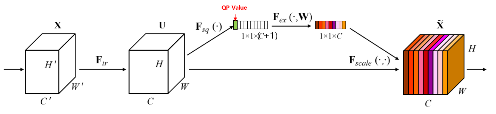

딥러닝 아이디어 노트
=============
- 이미 지나간 시간에 실험은 할 수 없다. 몸은 놀아도 실험컴은 놀지말자.
>
>
>>### 2019년 10월 16일 
> - - -
>### 1. SENet의 NN에 QP 추가 하여 Feature Map 재조정
>       Offline Training
>       In-loop Filtering
>   * SENet의 모듈을 이용하여 QP나 ALF Mode Index등의 CTU 전체에 같은 값이 적용되는값에 대하여 Complex측면이나 효율성에서 더 나은 정보를 전할 수 있을 것으로 보임.
>   * 많은 Convolution layer중에 어디에 NN QP를 추가 할지는 여러번의 실험으로 결정해야 할것 (네트워크 초반, 중반, 후반, 모두 등등..)
>   
>
>       현재 MobileNetwork의 Anchor가 실험 완료되는대로 순차적 실험 예정. 
>
```
    Total params: 82,788
    Trainable params: 82,788
    Non-trainable params: 0
    ----------------------------------------------------------------
    Input size (MB): 0.20
    Forward/backward pass size (MB): 875.77
    Params size (MB): 0.32
    Estimated Total Size (MB): 876.29
    ----------------------------------------------------------------

```
>### 2019년 10월 18일 추가사항
>- - -
>####   * ~~학습이 안정적으로 안되는 것으로 보임~~
>####    * SENet 부터 차근차근 연구 필요?
>- - -
>
>### 2. Unfiltered Reconstruction을 활용한 Encoder-Decoder Side Prediction Filtering
>       Online Training
>       Intra-Inter Prediction
>   * Decoder에서 Reconstruction은 당연히 알 수 있다. 이를 이용하여 Prediction 신호를 CNN을 이용하여 Filtering 하되, Prediction과 Reconstruction의 차이를 이용하여 Network를 Online Training 한다.
>   * 적절한 Training Control이 필요할 것으로 보인다. 현재 생각으로는 Pixel loss Sum를 계속 Accumulate Mean 하다가, 특정 loss Threshold가 넘어가는 순간 Training을 진행하는 방향이 어떨까싶다.
>   * 최초 실험에서는 계속 Training 하는 방향도 괜찮아 보인다.
>   * Training을 할지 최초의 Weight로 회귀할지 Control 하는 것도 좋아보인다. 
>   * Prediction Block 크기를 어떻게 Control할지도 문제이다. 각각의 네트워크로 처리할지, 네트워크의 입력으로 Control 할지 천천히 생각해보자.
>   * 당연히 최초의 Network를 TrainingSet으로 학습 시켜야 하며, Validation Set을 이용하여 인코더 Side에서 최적의 LearningRate나 위에서 설명한 loss Threshold를 컨트롤 해야 할 것 같다.


- - - 
> ### 2019년 10월 19일
> - - -
>### 1. 학습을 마치고 Loss가 나는 Training, Validation Set Drop
>   * Inloop Filtering의 경우 학습을 마치고 Picture 단위로 FCN을 걸고 32, 64, 128block
>단위로 MSE Loss를 계산하여, flag를 전송, 원래 Recon보다 좋지 않으면 기존의 Recon을 쓰는
>방식이 유효하다. 이러한 과정에서 생각해볼때, 어느정도 혹은 완전히 학습을 마쳤다고 생각했을때 
>기존의 Recon보다 Filtering 결과가 안 좋다면, 그 Training Set은 학습하지 않는게 옳을 수 있다.
>
>

- - -
###2019년 10월 27일

- - -

>### 1. CTU 혹은 64x64 블록단위로 내부 CU의 Depth 총합을 통한 내부 복잡도에 따른 네트워크
>       In-loop filtering
>       Offline Training
>   * pix2pix 같은 FCN을 돌려보면 하늘이나 건물 도로는 괜찮게 Processing 되지만 차나 디테일한 부분을 떨어진다.
>   * 하나의 프레임 안에 너무 많은 정보들이 들어가면 그 프레임 안에 작은 영역의 fine detail 차이는 아무래도 거시적인 영역에 비해 덜 dominant해서 묻힐 수 있다.
>   * 이것을 해결하기 위하여 이전의 MSE 정보등을 이용하여 복잡한 Residual을 가지는 부분을 더 많이 Processing 하고자 하였으나 한계가 존재하였다.
>   * 단순히 Input을 Channel Concat이 아니라 ICCV의 논문을 보니 하나의 Vector를 MLP구조를 통해 더 많은 정보를 뽑아 내고자 하였다. (이것이 어떤 의미인지는 잘 모르겠다.)
>   * 이러하게 다양하게 추가적인 정보를 Network의 Input으로 줄 수 있는 방안을 생각해 보는것이 중요할듯 싶다.
>   * 앞에서 설명한 것과 같이 복잡한 CTU와 아닌 CTU는 MSE를 굳이 전송하지 않아도 내부 CU들의 Depth의 총합으로도 대충 알 수 있다. (둘의 Correlation을 도출 하는 것 부터가 실험의 시작이 될듯)
>   * 이후 여러가지 방법으로 CTU에 복잡도에 따라 다른 Processing을 하고 싶다.
>